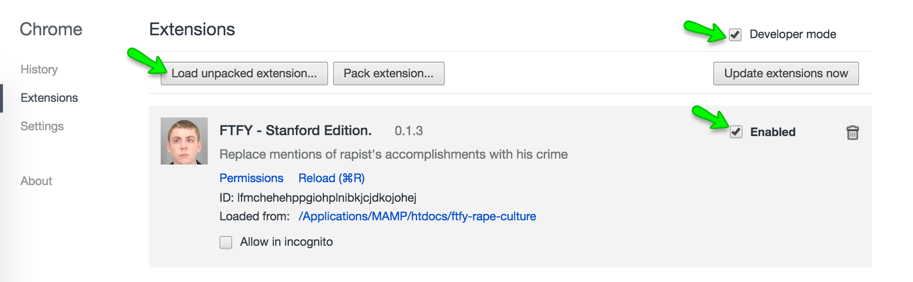

Fixed That For You - Stanford Edition

This is a Chrome extension which replaces various mentions of "ex-Stanford swimmer"
with "convicted rapist"

To enable, download and unzip the folder.

Go to chrome://extensions/

Click "Load Unpacked extension" and select the folder you unzipped.

Check "enabled" next to the extension and "developer mode" in the upper right.

